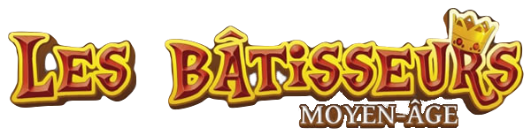

 
<h1>1) The project</h1>

The goal of this project was to code the board game "Les Batisseurs : Moyen-Âge" (published in 2014) in Java.
The program, in its basic version, must allow the user to play a game, by implementing its basic rules.
 This projet was divided in 3 main parts : the specifications writing (client's expectation, functionalities, tests planned...) ; the conception & analysis part (class diagrams construction,code's skeleton writing...) and the programming part (the productio of  the deliverable).

<h1>2) Diagrams</h1>

The different diagrams of this project has been done with Visual Paradigm.
 The **analysis class diagrams** are basics diagrams that only show the public class elements & the relationships between the different classes.
 The **conception class diagrams** are more detailed diagrams, that show the multiplicity between the different classes, and all the class' elements.
 The diagram showed in the synthesis document has been obtained by using the reverse code engineering tool from Visual Paradigm.

<h1>3) The code</h1>
The code's documentation can be found in the javaDoc folder.
 The code organization respect the MVC model, to make easier the programmation of the different interfaces.

<h1>4) To be implemented</h1>
There are a few functionalities that need to be implementend, if you follow what has been said in the specifications.
The biggest one is the implementation of a **functional** graphical interface.  The V1.0 of the project only provide menus panels, that are not linked to each other.
Some other functionalities :

+ Ingame music
+ Extension pack for the game (requires appropriate card scans)
+ Different IA levels
+ Ranking at the end of the game
+ Overview of the opponents' cards
